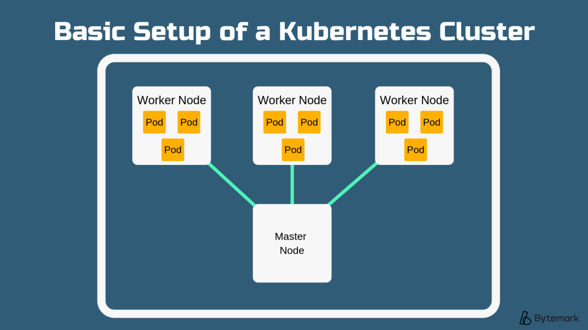
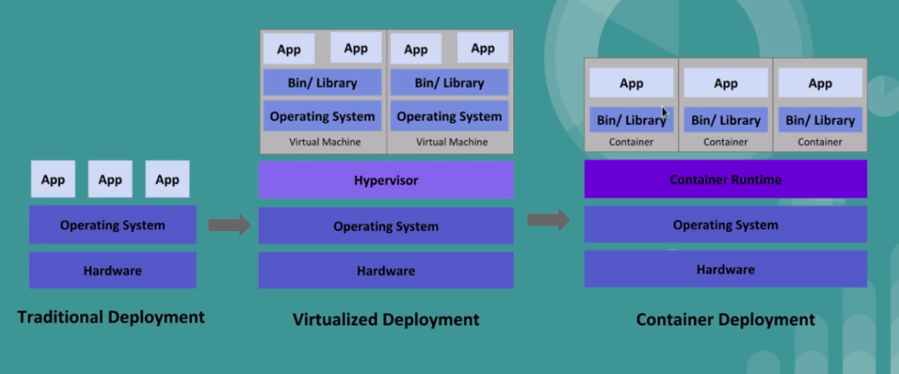
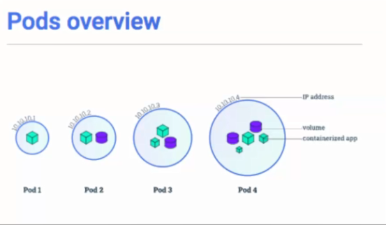

# Indice
- [Dockers](#dockers)
- [Kubernetes](#kubernetes)
- [Arquitectura](#arquitectura)
  * [Master Node](#master-node)
  * [Kube Scheduler](#kube-scheduler)
  * [Kube Controller](#kube-controller)
  * [Etcd](#etcd)
  * [Kubelet](#kubelet)
  * [Kube Proxy](#kube-proxy)
      - [Contenedores](#contenedores)
- [Instalaciones](#instalaciones)
    + [Kubernetes](#kubernetes-1)
    + [Minikube](#minikube)
- [Minikube](#minikube-1)
  * [Comandos](#comandos)
  * [Minikube 101](#minikube-101)
    + [Troubleshooting](#troubleshooting)
- [Addons](#addons)
- [Pods](#pods)
  * [Metadatos](#metadatos)
  * [Problemas](#problemas)
- [Selector](#selector)
- [Replication Controllers](#replication-controllers)
- [Replica Set](#replica-set)
  * [Problemas](#problemas-1)
- [Deployments](#deployments)
- [Servicios](#servicios)
- [Volumenes](#volumenes)
- [ConfigMaps](#configmaps)
- [Secrets](#secrets)
- [Funcionalidades](#funcionalidades)
  * [Request Limits](#request-limits)
  * [Escalamiento](#escalamiento)
  * [Annotations](#annotations)
  * [RBAC](#rbac)
- [Kops en AWS](#kops-en-aws)
    + [ELB](#elb)
    + [ALB (App Load Balancer)](#alb--app-load-balancer-)
      - [Ingress Controller](#ingress-controller)
- [EKS](#eks)
    + [Eliminamos Cluster](#eliminamos-cluster)

<small><i><a href='http://ecotrust-canada.github.io/markdown-toc/'>Table of contents generated with markdown-toc</a></i></small>


# Dockers

# Kubernetes
Orquestador de Dockers, es una herramienta que nos ayuda a manejar contenedores, <br />
k8s (contraccion de Kubernetes)<br />
Si un contenedor cae, otro contenedor deberia iniciar, algo que lo haga automaticamente <br />
*Aclaracion*: en algunos ejemplos utilizaremos **k** en lugar de **kutectl**

# Arquitectura

## Master Node
Tenemos un master que da las ordenes y los nodos, el master es el cerebro, el que da las ordenes, el que controla a los nodos<br />
<br />
En el master tengo el **Api Server**, me comunico con Kubernetes mediante esta api, en formato JSON, podemos utilizar un lenguaje de programacion o<br />
Con **kubectl** utilizamos el comando para decirle a kubernetes que queremos<br />

## Kube Scheduler
Cuando hago una solicitud a la api, kubernetes va a hablar con Scheduler.
Scheduler va a buscar el nodo que este libre y lo va a poner ahi<br />
<br />

## Kube Controller
Node Controller, si una maquina se cae kuberenetes se encarga de levantar otra, se encarga que las replicas esten siempre corriendo tambien

## Etcd
Base de datos clave valor donde el cluster almacena el estado, datos, backup, estados de como se esta moviendo todo en el cluster

## Kubelet
En cada nodo hay un Kubelet, servicio que esta corriendo en cada una de las maquinas que nos permite recibir ordenes del master y enviar informacion al master

## Kube Proxy
Corre en cada nodo, se encarga de todo el tema de red


#### Contenedores


# Instalaciones

### Kubernetes
```sh
sudo apt-get install apt-transport-https ca-certificates curl gnupg-agent software-properties-common -y

#Instalamos Kubernetes
curl -LO https://storage.googleapis.com/kubernetes-release/release/$(curl -s https://storage.googleapis.com/kubernetes-release/release/stable.txt)/bin/linux/amd64/kubectl
chmod +x ./kubectl
sudo mv ./kubectl /usr/local/bin/kubectl
```

### Minikube
```sh
#instalamos minikube
egrep --color 'vmx|svm' /proc/cpuinfo
curl -Lo minikube https://storage.googleapis.com/minikube/releases/latest/minikube-linux-amd64 \
    && chmod +x minikube
sudo cp minikube /usr/local/bin && rm minikube
sudo apt-get install -y virtualbox

# Para confirmar la instalacion
minikube status


# Como lo utilizaremos con dockers utilizamos none
# minikube start --vm-driver=none
# Mas reciente
minikube start --vm-driver=docker
```

Para simular el cluster necesita un Hypervicor como VirtualBox o KVM, o podemos utilizar Docker <br />
Vemos en el root dos carpetas **.kube** y **.minikube** que es donde vamos a configurar la autentificacion hacia la API de kubernetes

```sh
sudo apt-get install htop -y # ver recursos  de nuestra maquina, version avanzada de top
htop

```

# Minikube

**Minikube** nos va a permitir crear un cluster de kubernetes en una pequeña maquina virtual de manera local, de esta forma podemos practicar los comandos de Kubernetes sin necesidad de crear un gran cluster

## Comandos

```sh
minikube status # Status

# para liberar recursos que esta consumiendo minikube en nuestras maquinas
# Si aparece un error de /tmp/juju-*, es un bug de minikube, borrando ese archivo funciona
minikube stop 

#Levantamos minikube
minikube start

```

## Minikube 101

Asignamos 2 cpu, 1G de RAM y el virtualbox que instalamos como driver<br />
Inicializamos la maquina que vamos a usar
```sh
minikube start --cpus=2 --memory=1G --driver=virtualbox
```

Vamos a usar el de Dockers que es el que nos interesa
```sh
minikube start --cpus=2 --memory=1G --driver=docker
```

```sh
minikube status # Estado de varios componentes
kubectl get nodes # Muestra los nodos que se estan ejecunado
kubectl get all # Todos los objetos que estan creados

minikube pause # Esto va a pausar el clouster, si ejecuto ahora un get node no va a responder
minikube unpause # Restauro el estado del clouster (pause y unpause medio al pedo)

minikube stop # Para el closter directamente, todos los componentes, para volver a levantarlo start
```

En el archivo **./minikube/config/config.json**<br />
podemos fichar opciones, generamos una con el comando
```sh
minikube config set cpus 2
```
Vemos que el json queda asi ahora, si hago un delete y un start, arrancaria ya con esas opciones
```json
{
    "cpus": 2
}
```
Eliminamos una opcion
```sh
minikube config unset cpus
```

### Troubleshooting
```sh
minikube ip # Obtener IP
minikube ssh # Nos conectamos al cluster, podemos ver todos los dockers dentro
minikube logs # Logs del sistema
minikube logs f --problems=true # Logs solo de los errores
minikube update-check # Ultima version de minikube
```

```sh
minikube addons list # Podemos ver todos los addons
minikube addons enable nombre-del-addons # Activamos el addons
# Los componentes van a arrancar en forma de contenedor en nuestro cluster

minikube nombre-del-addons # Nos abre el addons, en este caso lo hicimos con dashboard
```

# Addons
Componentes de kubernetes
- **dashboard**: Nos va a mostrat informacion de todo lo que esta corriendo

```yaml
apiVersion: apps/v1
kind: Deployment # Tipo de objetos
metadata: # metadatos de uso interno
    name: nginx-deployment
spec:   # Especificacion
    selector:
        matchLabels:
            app: nginx
    replicas: 2 # 2 pods
    template:
        metadata:
            labels:
                app: nginx
        spec:
            containers:
            -   name: nginx # contenedor nginx
                image: nginx:1.7.9 # va a descargar de docker hub
                ports:
                -   containerPort: 80 # puerto expuesto
```
```sh
# Podemos hacerlo de esta manera tambien, pero es muy propensa a errores
kubectl run --image=nginx:1.7.0 --port:80 --replicas=2 nginx-deployment
```

# Pods


Va a indicar un contenedor o un grupo de contenedores, no podemos ejecutar un contenedor a secas
como lo hacemos con Docker, debemos hacerlo mediante un pod<br />
Un Pod estara en ejecucion el tiempo que su proceso principal este en ejecucion, un pod por lo general sera un servidor web, una base de datos, etc..<br />
Debo manipular mediante **kubectl** si lo hago mediante el Docker voy a tener problemas<br />

<br />
Un Pod es uno o mas contenedores que comparten namespaces entre si, los namescpace que comparten son:
- Red
- IPC (Inter Process comunication) los Dockers van a poder ver los procesos entre ellos
- UTS (El Hostname)<br />
Vamos a tener una unica IP para entrar a todos los Containers del POD, el Pod en si mismo no corre, es solo un encubrimiento para los Dockes, los que si corren son los dockers<br />
- NAME: nombre del Pod
- READY: Dockers del Pod
<br />En kubernetes la estrategia de un contenedor por Pod es la mas utilizada<br />
<br />
<br />

Generamos un archivo **pod-test1.yaml**

```yaml
apiVersion: v1
kind: Pod #Tipo de objetos
metadata: #metadatos de uso interno
    name: nginx
spec:   #Especificacion
    containers:
    -   name: nginx #contenedor nginx
        image: nginx:1.7.9 #va a descargar de docker hub
        command: echo "cont1" # comandos que podemos ejecutar
        ports:
        -   containerPort: 80

--- # podemos agregar mas pods separados por 3 -


```

```sh
kubectl apply -f 
kubectl get all # Objeto de pod-test1.yaml tipo Pod que esta corriendo
kubectl get pods
kubectl get pods -o wide # Vemos en que nodo se esta ejecutando los Pods

kubectl describe pod {nombre} # detalle del pod
kubectl delete -f {nombre} # eliminamos por el nombre pod-test1.yaml 
kubectl delete pod {nombre} # o por el tipo de objeto (pod) y el nombre del objeto (nginx)
```
Si vemos la IP del pod y tratamos de acceder no vamos a poder desde afuera, para verlo debemos entrar
```sh
minikube ssh
docker ps # Listamos dentro de minikube los dockers que estan corriendo
```
Cuando levantemos un Pods no vamos a poder verlo desde afuera hasta que levantemos un servicio

```sh
kubectl apply -f pod-test1.yaml # ejecutamos el yaml que habiamos generado
kubectl exec -it nginx bash # Entramos al pod, nginx es el nombre del pod
kubectl exec -it doscont - cont1 -- sh #ingresar a un pod a al otro [cont1, cont2]

kubectl logs mipod # ver el log del pod

#instalamos curl
curl localhost # vemos como nos devuelve el html por defecto de nginx

kubectl port-forward nginx 8080:80 # nginx (nombre pod), del 80 de nginx al 8080 de nuestra maquina
# De esta manera haciendo un
curl localhost
# en nuestra maquina, podriamos acceder sin entrar al cluster
```

```sh
# Generamos un POD
kubectl run --generator=run-pod/v1 nombrepod --image=nginx:alpine

# Vemos el POD
kubectl get pods

# Vemos el POD
kubectl describe pod nombrepod

# Ver todo lo que nos proporcional la API de kubernetes
kubectl api-resources

# Eliminamos Pod
kubectl delete pod nombrepod

# Obtenemos el Manifest, el archivo yaml del POD
kubectl get pod nombrepod -o yaml
```

## Metadatos
```yaml
apiVersion: v1
kind: Pod #Tipo de objetos
metadata: #metadatos de uso interno
    name: nginx
    labels: # vamos autilizarlo para poder identificarlos de forma mas sencilla
      project: aplicacion1
      environment: testing # Podriamos identificar en los diferentes ambientes
spec:   #Especificacion
    containers:
    -   name: nginx #contenedor nginx
        image: nginx:1.7.9 #va a descargar de docker hub
        ports:
        -   containerPort: 80
```
Los labels son muuy importantes, no solo para filtrar sino para que los componentes de mas alto nivel puedan gestionarlos 
```sh
k get pods -l app=front
```

## Problemas
- No se recuperan solos, si uno muere, nadie va a crear uno nuevo
- No pueden replicarse

# Selector
Podemos filtrar y buscar los pods generados
```sh
kubectl get pods -o wide --show-labels --selector project=aplicacion1
```

# Replication Controllers
Escalabilidad horizontal, podemos generar replicas y darle escalabilidad horizontal, esto genera un replication controller, lo podemos ver con **kubectl get all -o wide --show-labels**
```yaml
apiVersion: v1
kind: Pod #Tipo de objetos
metadata: #metadatos de uso interno
    name: nginx
    labels:
      project: aplicacion1
      environment: testing # Podriamos identificar en los diferentes ambientes
spec:   #Especificacion
    replicas: 2 # ejecutamos 2 replicas
    containers:
    -   name: nginx #contenedor nginx
        image: nginx:1.7.9 #va a descargar de docker hub
        ports:
        -   containerPort: 80
```


# Replica Set
Dueño de los Pods<br />
Puedo generar replicas de pods. Si elimino un pod, el rs se va a encargar de generarlo nuevamente<br />
Va a soportar el nuevo modo de selectores, la recomendacion es no usar la Replica Set sino es su lugar utilizar los tipos **deployment**
```sh
kubectl get rs # listarlo
hubectl describe rs frontend # descripcion del replica set frontend
hubectl delete rs frontend # Eliminar
hubectl delete rs frontend --cascade=false # se elimina sin eliminar todo lo que RS haya creado
kubectl delete pod --all # Elimina todos los pods
```

## Problemas
Si actualizamos un rs con una nueva version, seguiran corriendo los otros pods

# Deployments
Dueño (Owner) de los Replica Set<br />
Nos ayuda a actualizar los RS, se encaga de mantener siempre una cierta cantidad de pods vivos<br />
Va a ser un emboltorio, tiene unos metadatos y el numero de replicas, viene bien
usarlo cuando queremos que un objeto deployment gestione sus mediaset y pods.<br />
```yaml
apiVersion: app/v1
kind: Deployment #Tipo de objetos
metadata: #metadatos de uso interno
    name: nginx-deployment
    labels:
      app: nginx
spec:
    replicas: 3
    selector: 
        matchLabels:
            app: nginx

    template:
        metadata:
            labels:
                app: nginx
        spec:
            containers:
            -   name: nginx
                image: nginx:1.7.9
                ports:
                -   containerPort: 80
```

```sh
kubectl set image deployment/nginx-deployment nginx=nginx:1.15;

# Nos va a mostrar el estado del rollout
# De todo lo que va pasando en el deployment
kubectl rollout status deployment/nginx-deployment
```
Podemos ir viendo el historico de los deployments
```sh
k rollout history deployment [deployment-name]

# Puedo ver los cambios
k rollout history deployment [deploy-name] --revision=[revision number]

# Hacer un rollback a la revision que queremos saltar
k rollout undo deployment [deploy-name] --to_revision=[revision number]
```


# Servicios

Para acceder desde afuera al puerto 80, un servicio es una abstraccion que define como va a ser el acceso externo, el pod que va a acceder en un servicio lo a va ser mediante un selector<br />
Pods -> Selection -> Servicio <br />

```sh
kubectl apply -f pod-test1.yaml 
```
Generamos un service
```yaml
apiVersion: v1
kind: Service #Tipo de objetos
metadata: #metadatos de uso interno
    name: my-service
    labels:
      project: aplicacion1
      environment: testing # Podriamos identificar en los diferentes ambientes
spec:
    type: NodePort 
    selector: # el servicio va a enviar el trafico a los que esten usando este selector
      project: aplicacion1
      environment: testing # Podriamos identificar en los diferentes ambientes
    ports:
      - protocol: TCP
        port: 80 # envia el trafico al puerto 80
```
```sh
kubectl apply -f servicio.yaml 
kubectl get all -o wide --show-labels # tiene que mandar a los labels que definimos,
                                      # sino va a mandar a un pod que no existe

minikube ip # nos devuelve la IP
curl 192.168.98.101.31318 # a la IP de minikube y al puerto servicio
```

En este caso si elimino el pod-ejempli1.yml no me afecaria el puerto del servicio
- ClusterIP: Expone servicio en ip interna del cluster
- NodePort: Expone servicio en cada ip de los nodos, puerto estatico
- LoadBalancer: Expone el servicio externamente usando un load balancer


# Volumenes
Podemos asociar volumenes a Pods (manera por defecto), pero existen otros tipos de volumenes (este seria el volumen local), veremos otros tipos en AWS<br /><br />

# ConfigMaps
Vaalores de configuracion o ficheros que le vamos a pasar a nuestros contenedores
```sh
kubectl create configmap test-cm --from-literal variable1=valor1
kubectl descrive cm test-cm
```

# Secrets
PArecida a los ConfigMaps pero para almacenar cosas sensibles (password, token, etc), se van a almacenar de forma encriptada a travez de variables de entorno

```sh
kubectl get secrets # listar secrets
kubectl create secret generic nombre_credeciales --from-file=./file.txt --from-file=./otro_file.txt # los codifica en base64
kubectl describe secrets nombre_credeciales
kubectl get secrets nombre_credeciales -o yaml
```

# Funcionalidades

## Request Limits

- request: cuanos recursos necesitaran los povs como minimo
- limit: maximo recursos que nuestro povs van a utilizar
<br />
tipos de recursos: memoria o cpu

## Escalamiento
Cuanto trabajemos con kubernetes utilizaremos horizontal pod autoscaler (HPA)

## Annotations
Igual que un label pero cambia donde lo usaremos, nos va a permitir agregar a los objetos datos para leer por otros kubernetes. Label nos permiten filtrar, Annotations nos permite agregar notas para detallar

## RBAC
nos permite la autorizacion, permisos basados a roles

# Kops en AWS
vemos la documentacion en https://github.com/kubernetes/kops
<br />
Para  instalarlo:
```sh
curl -LO https://github.com/kubernetes/kops/releases/download/$(curl -s https://api.github.com/repos/kubernetes/kops/releases/latest | grep tag_name | cut -d '"' -f 4)/kops-linux-amd64
chmod +x kops-linux-amd64
sudo mv kops-linux-amd64 /usr/local/bin/kops
```

Comandos basicos de cluster https://kops.sigs.k8s.io/getting_started/commands/#kops-rolling-update-cluster
```sh
kops create cluster # creamos cluster
```
Para este ejemplo creamos un s3 hosteado, kops genera una entrada NS para que nos podamos conectar al api de kubernetes
```sh
export KOPS_STATE_STORE=s3://vcc-test-kops/

# este paso registra el cluster en la configuracion
# --zone -> zona de los nodos
# --master-zone -> zona nodos maestros
kops create cluster --name testcluster.hosts3.co.uk --zone=eu-west-1a,eu-west-1c,eu-west-1c --master-zone=eu-west-1a,eu-west-1c,eu-west-1c --cloud aws --ssh-public-key /home/ncostamagna/.ssh/id_rsa.pub
# Va a crear un monton de recursos para que el cluster empiece a funcionar

# este paso va a forzar los cambios del cluster
kops update cluster testcluster.hosts3.co.uk --yes
# va a crear cosas y exportar el kubecfg para que tengamos lista nuestra linea de comando
# hay que esperar un poquito
```

**Instance Groups**<br />
Vemos que genero las instancias masters en cada zone y los nodos en que zona de disponibilidad
<br /><br />

- Vamos a la consola de EC2 y vemos que ya esta empezando a crear las instancias
- Vamos a ver los Auto Scaling groups y vemos que corresponden con los q cremos, uno para cada master y uno para los nodos, cada uno de ellos tiene un Launch Configuration
- Vamos a los Launch Configuration y vemos que tiene configurado
- Se han creado varias entradas NS en Route53, tenemos una entrada interna y externa, vamos a usar la externa para atacar el api de kubernetes

```sh
# ejecutamos la vaidacion y vemos que ya hay nodos
kops validate cluster

# listo y veo los nodos
kubectl get nodes 

# informacion del cluster
kops get testcluster.hosts3.co.uk

# informacion de los instance groups
kops get ig

# podemos modificar algun instance group en particular, en este caso el nodes
kops edit ig nodes
# podemos editar y darle 3 size min y max, para que me de 3 nodos
# luego debo actualizar el cluster
kops update cluster testcluster.hosts3.co.uk --yes

# podemos ejecutar tambien lo siguiente
# va a matar algunas instancias y las va a volver a crear
kops rolling-update cluster

# Para eliminar el cluster completo
kops delete cluster
# me pide el nombre del cluster por seguridad
kops delete cluster --name testcluster.hosts3.co.uk --yes
```
- get: informacion del cluster
- describe: podemos describit cosas del cluster
- edit: podemos editar cosas del cluster, la definicion de configuracion del cluster

<br />
podemos exportar el modelo a terraform: 
```sh
--target=terraform
```
https://kops.sigs.k8s.io/getting_started/arguments/

<br /><br />
Levantamos el cluster de nuevo, desplegamos nuestro primer Deployment

```yml
apiVersion: apps/v1
kind: Deployment
metadata:
  name: nginx-deployment
  labels: 
    app: nginx
spec:
  replicas: 1
  selector:
    matchLabels:
      app: nginx
  template:
    metadata:
      labels:
        app: nginx
    spec:
      containers:
      - name: nginx
        image: minahue/nginx-helloworld
        ports:
        - containerPort: 80
```

Lo desplegamos
```sh
kubectl apply -f nginx-deployment.yml

# hacemos en get all para ver como esta el pod
kubectl get all
```

### ELB 
Creamos un servicio de tipo Load Balancer
```yml
kind: Service
apiVersion: v1
metadata:
  name: nginx-lb
  labels: 
    app: nginx
spec:
  type: LoadBalancer
  selector:
    app: nginx
  ports:
    - protocol: TCP
    port: 80
```
Le damos un apply y vemos en la consola de AWS que ya tenemos un nuevo ELB, si queremos agregar mas nodos tenemos que aumentar el numero de reeplicas en el ELB del yml, si ponemos mas replicas de los nodos que tenemos va a ir repitiendo los nodos

```sh
kops edit ig nodes
# aumento a 3 el maxSize y el minSize
# hacemos el update
```
Ahora volvemos a correr el ELB con las 3 replicas y vemos que en AWS ya aparece con 3 nodos<br />

### ALB (App Load Balancer)
Necesitamos 2 componentes 

#### Ingress Controller
va a ser un nodo que se va a deplegar a nivel de todo el cluster, va a estar vigilando cambios constantemente<br />
https://github.com/kubernetes-sigs/aws-alb-ingress-controller/blob/master/docs/examples/alb-ingress-controller.yaml

```yml
apiVersion: apps/v1
kind: Deployment
metadata:
  labels:
    app.kubernetes.io/name: alb-ingress-controller
  name: alb-ingress-controller
  namespace: kube-system
spec:
  selector:
    matchLabels:
      app.kubernetes.io/name: alb-ingress-controller
  template:
    metadata:
      labels:
        app.kubernetes.io/name: alb-ingress-controller
    spec:
      containers:
        - name: alb-ingress-controller
          args:
            - --ingress-class=alb
            - --cluster-name=testcluster.hosts3.co.uk
            - --aws-vpc-id=vpc-{VPC ID} # el ID de la VPC
            - --aws-region=us-west-1 # region
          env:

          image: docker.io/amazon/aws-alb-ingress-controller:v1.1.9
      serviceAccountName: alb-ingress-controller
```
Y estos van a ser los permisos que vamos a necesitar y los roles
```yml
---
apiVersion: rbac.authorization.k8s.io/v1
kind: ClusterRole
metadata:
  labels:
    app.kubernetes.io/name: alb-ingress-controller
  name: alb-ingress-controller
rules:
  - apiGroups:
      - ""
      - extensions
    resources:
      - configmaps
      - endpoints
      - events
      - ingresses
      - ingresses/status
      - services
      - pods/status
    verbs:
      - create
      - get
      - list
      - update
      - watch
      - patch
  - apiGroups:
      - ""
      - extensions
    resources:
      - nodes
      - pods
      - secrets
      - services
      - namespaces
    verbs:
      - get
      - list
      - watch
---
apiVersion: rbac.authorization.k8s.io/v1
kind: ClusterRoleBinding
metadata:
  labels:
    app.kubernetes.io/name: alb-ingress-controller
  name: alb-ingress-controller
roleRef:
  apiGroup: rbac.authorization.k8s.io
  kind: ClusterRole
  name: alb-ingress-controller
subjects:
  - kind: ServiceAccount
    name: alb-ingress-controller
    namespace: kube-system
---
apiVersion: v1
kind: ServiceAccount
metadata:
  labels:
    app.kubernetes.io/name: alb-ingress-controller
  name: alb-ingress-controller
  namespace: kube-system
...
```
```sh
# Ejecutamos
kubectl apply -f rbac-role.yaml -f alb-ingress-controller-yaml

# muestre las equitetas asi los puedo filtrar
kubectl get pods -n kube-system --show-labels

# vemos el log del ingress que listamos anteriormente
kubectl -n kube-system logs alb-ingress-aasdas-ad -f
```
External DNS, nos va a pertmitir configurar servicios externos de DNS sin un provider cloud

# EKS

Crearemos un usuario IAM para hacer todas las tareas y le doy permisos de administrador, copio las key y lo registro en el aws cli <br/><br/>

Me copio en un fichero el nginx-deployment.yml y el servicio.yaml
```yml
apiVersion: apps/v1
kind: Deployment
metadata:
  name: nginx-deployment
  labels: 
    app: nginx
spec:
  replicas: 3
  selector:
    matchLabels:
      app: nginx
  template:
    metadata:
      labels:
        app: nginx
    spec:
      containers:
      - name: nginx
        image: minahue/nginx-helloworld
        ports:
        - containerPort: 80

```

```yml
kind: Service
apiVersion: v1
metadata:
  name: nginx-lb
  labels: 
    app: nginx
spec:
  type: LoadBalancer
  selector:
    app: nginx
  ports:
    - protocol: TCP
    port: 80
```
Creamos un Role IAM para EKS y le asignams las policies AmazonEKSClusterPolicy y AmazonEKSServicePolicy

<br /><br />
Creamos un security group que acepte el trafico HTTPS por 443

<br /><br />
Entramos con el usuario que creamos y creamos el cluster EKS

- creamos un cluster EKS
- le agregamos un nombre
- elegimos el role que creamos antes
- elegimos la VPC y las 3 subredes
- elegimos el security group

<br />
Debemos instalar un autentificador de AWS para manejar los usuarios de Kubernetes desde aws
https://docs.aws.amazon.com/eks/latest/userguide/install-aws-iam-authenticator.html

```sh
curl -o aws-iam-authenticator https://amazon-eks.s3.us-west-2.amazonaws.com/1.17.9/2020-08-04/bin/linux/amd64/aws-iam-authenticator

chmod +x ./aws-iam-authenticator

sudo mv aws-iam-authenticator /usr/local/bin
```
Este se va a contactar con el cluster a travez de IAM y obtener un token de autentificacion

```sh
# va a generar un fichero de configuracion, debemios esperar gasta que este activo
aws eks update-kubeconfig --name cluster_name

# vemos todo lo que tenemos arriba
kubectl get all

```

Vamos a empezar a desplegar los nodos <br />
lanzamos un stack en CloudFormation y le pegamos el yaml que indica en la documentacion: https://docs.aws.amazon.com/eks/latest/userguide/launch-workers.html

- ponemos el nombre del stack
- nombre del cluster
- security group, mismo que usamos
- nombre al grupo de nodes,
- tamaño
- tipo instancia
- NodeImageId: ID de instancia AMI que indica en la documentacion (Amazon EKS-optimized AMI)
- tamaño
- indicamos la VPC y las subnets
- indicamos la opcion AWS CloudFormation might create IAM resources
- nos bajamos el fichero
```sh
curl -o aws-auth-cm.yaml https://amazon-eks.s3.us-west-2.amazonaws.com/cloudformation/2020-08-12/aws-auth-cm.yaml
```
el rolearn va a ser el que vamos a ver en el outputs del stack
```yml
apiVersion: v1
kind: ConfigMap
metadata:
  name: aws-auth
  namespace: kube-system
data:
  mapRoles: |
    - rolearn: arn:aws:iam::97823423823:role/eks-vcc-stack-NodeInstanceRole-1DAPILTOG # agregamos aca
      username: system:node:{{EC2PrivateDNSName}}
      groups:
        - system:bootstrappers
        - system:nodes
```
- modificamos el stack (ponemos arriba y damos Update Stack)
- current template
- modificamos el tamaño a 4
<br />
Se va a crear una nueva instancia y se agregara al cluster

### Eliminamos Cluster
UNa de las desventajas de EKS es que no podemos bajarlo directamente, si lo hacemos van a quedar componentes actibvos

```sh
kubectl delete -f ingress.yaml -f servicio.yaml
kubectl delete -f deployment.yaml
# y eliminamos todo lo que fuimos instalando
```
